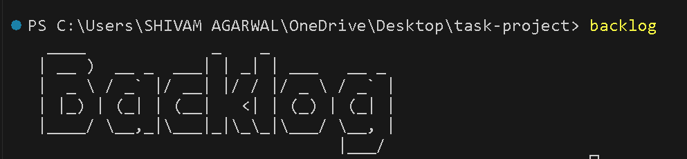
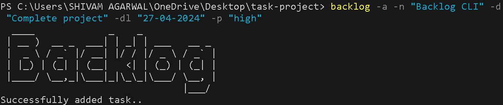
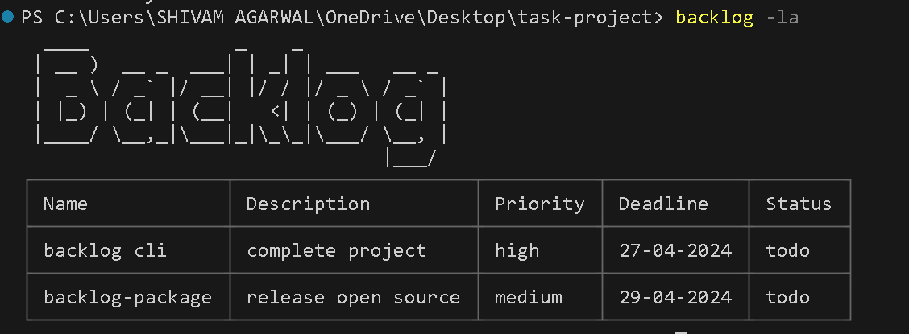

# Backlog CLI Manager

This is a cli tool project craeted to manage tasks and backlogs on cli for developers who want quick access of all tasks while working on terminal itself.



## Installation

1. ``` npm install -g backlog-cli-manager ```

2. If it says backlog already exists, use --force flag
``` npm install -g backlog-cli-manager --force ```

3. In windows systems, set permission to access files by

``` Set-ExecutionPolicy RemoteSigned -Scope Process ```

## Release: 0.1.0

## Features:

### Add backlog with name, description, priority, deadline and in todo status by default

``` backlog -a -n <name> -p <priority> -dl <deadline> -d <description> -t ```



### Change status to working or completed

``` backlog -n <name> -w ```

or

``` backlog -n <name> -c ```

### Get list of all backlogs

``` backlog -la ```



### Get list by a priority, deadline or status

``` backlog -l -p <priority> ```

or

``` backlog -l -dl <deadline> ```

or

``` backlog -l -c/w/t ```

### Remove a backlog

``` backlog -r <name> ```

### Important : 
Check Compliance before installing in Organisation Systems

### For queries: 
Reach out by creating comments/issues/mail or connect to social media via:

[Twitter](https://twitter.com/Agarwal__Shivam)

[LinkedIn](https://www.linkedin.com/in/shivam-agarwal-profile)